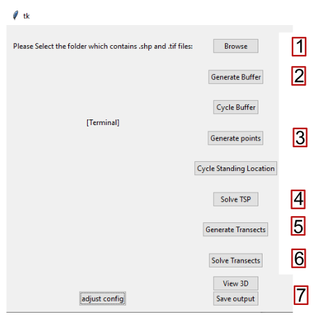
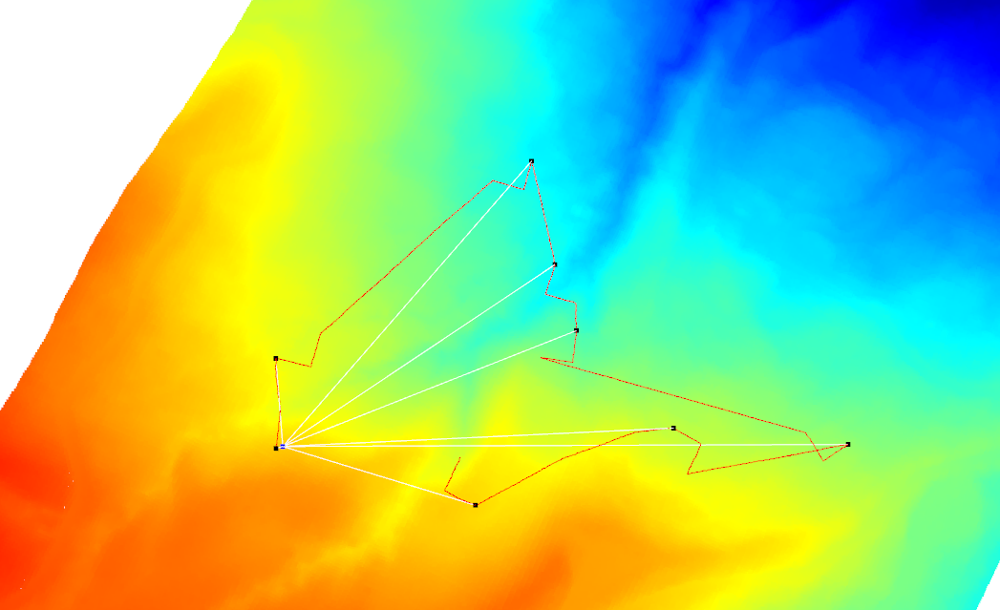

# UAV PROJECT 2.0.1

Work completed in collaboration with Interpine NZ\\
This is an initial draft

## Requirements

Each folder must contain:

- .tif file highlighting the area
- .shp file showing the areas to be assessed
- An optional but reccomended .txt file that contains mercader coordinates(x,y or x,y,z) of the available standing locations (allow DVLOS), examples in standing locations

## Runtime

1. Run GUI.py
2. Use browse button to locate folder
3. From the top follow down pressing each button at least once (apart from the cycle buttons, and config)
4. Save output will save to the OUTPUT folder

A 3D view is useable that will display as shown

### Configuration

Configuration is available from the bottom left of the window
Main parts are listed below:

- buffer_m: Controls the minimum distance a drone can be from a border
- distance_to_nearest_point_m: Controls the proximity of point generation - minimum distance between two points
- height_above_ground: the height above the ground that the drone will remain at
- number_of_points_per_area: the number of points that will be generated inside each buffer
- human_height_above_ground_m: used to determine DVLOS, do not set bellow DVLOS_m\\

Defaults are provided that will effectively work in most circumstances

## Limitations

- No flight area implemented
- Currenty line of sight is only guarrenteed for each plot and not the journey there.
- The final point in the csv output will always face north
- Ant colony config not implemented
- No valid input checks for the config page
- Default config still to be tuned
