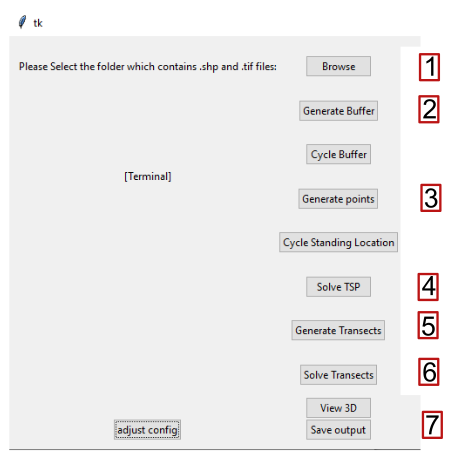
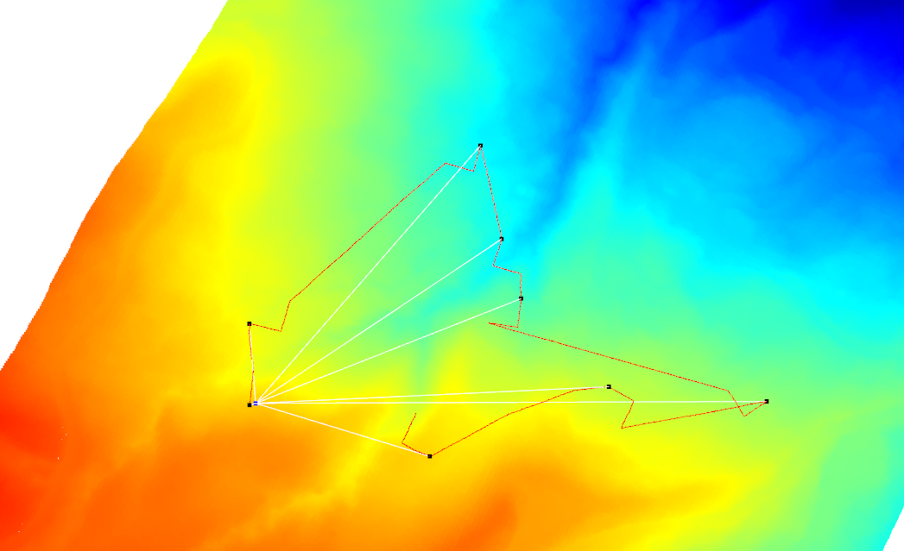

# UAV PROJECT 2.1.1
## Overview
This is a python based tool used for the automation of drone flight planning for forestry and environmental monitoring. The system generates safe and efficient UAV flight paths over large terrain areas by combining geospatial data, to eliminate manual waypoint creation. 
The software ensures the drone remains at a constant height above the terrain whilst abiding by NZ legislation requiring direct visual line of sight with the operator whilst it visits generated way points and captures data at each.
Developed in collaboration with Interpine Group Ltd, the tool achieved a 720× reduction in flight-planning time compared to traditional manual methods whilst maintaining or shortening operational distances and has been adopted for weekly operational use in forestry surveys.

## Requirements

Python 3.12.x is required for this software to run.

Each folder must contain:
- .tif file highlighting the area
- .shp file showing the areas to be assessed

Optional extras:
- a .shp file with a name including 'flyable' highlighting the flyable area around a plot, useful for small disconnected plots
- a .shp / .txt file containing possible operator positions
- a .shp file containing pre programmed waypoints to be visited

## Installation

git clone https://github.com/Maxrob440/UAV-flight-path-tool 
cd UAV-flight-path-tool 
python3 -m venv venv 
source ./venv/bin/activate 
pip install -r requirements.txt 

## Runtime

1. Run GUI.py
2. Use browse button to locate folder
3. From the top follow down pressing each button at least once (apart from the cycle buttons, and config)
4. Save output will save to the OUTPUT folder

A 3D view is useable that will display as shown

### Configuration

Configuration is available from the bottom left of the window
Main parts are listed below:

- buffer_m: Controls the minimum distance a drone can be from a border
- distance_to_nearest_point_m: Controls the proximity of point generation - minimum distance between two points
- height_above_ground: the height above the ground that the drone will remain at
- number_of_points_per_area: the number of points that will be generated inside each buffer
- human_height_above_ground_m: used to determine DVLOS, do not set bellow DVLOS_m 

Defaults are provided that will effectively work in most circumstances

## Acknowledgements
I would like to express my gratitude to my supervisor, Dr Milto Miltiadou, for her invaluable guidance, support, and constructive feedback throughout the course of this project.
I am also grateful to Sam West, Susana Gonzalez and Jack Guo from Interpine Innovation for their collaboration and practical insights, which provided valuable context and relevance to the project. Their input helped bridge the gap between academic research and real-world forestry applications.
